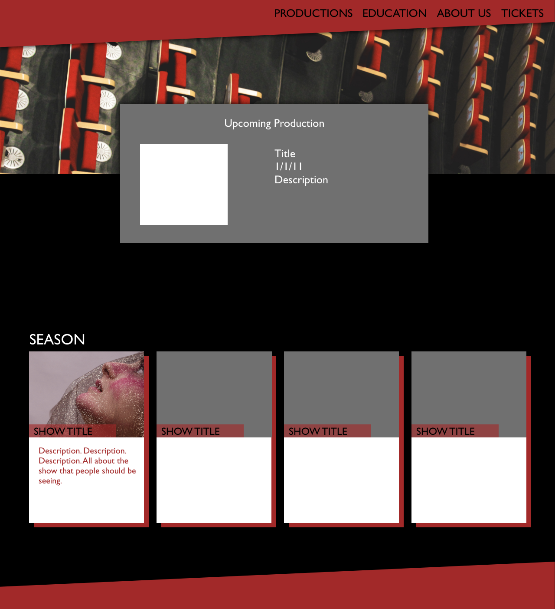
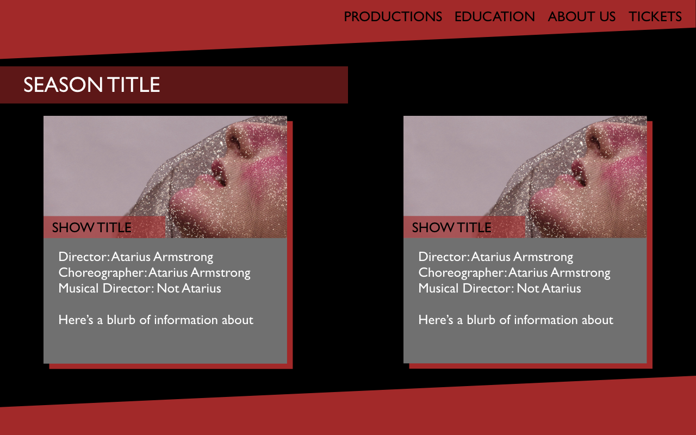
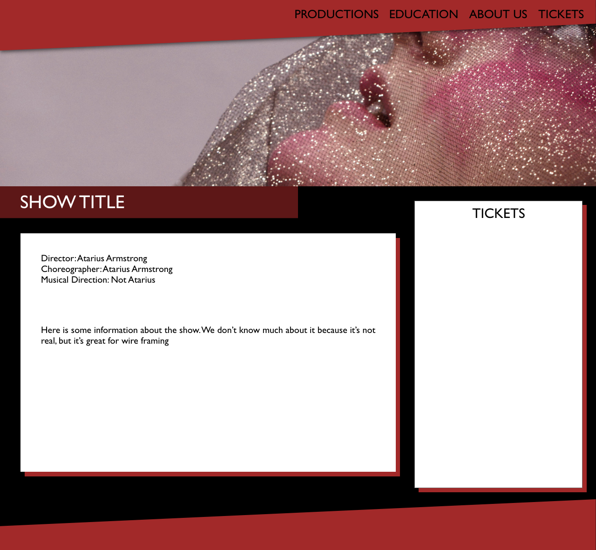
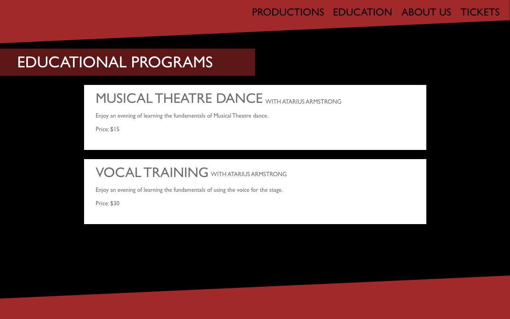
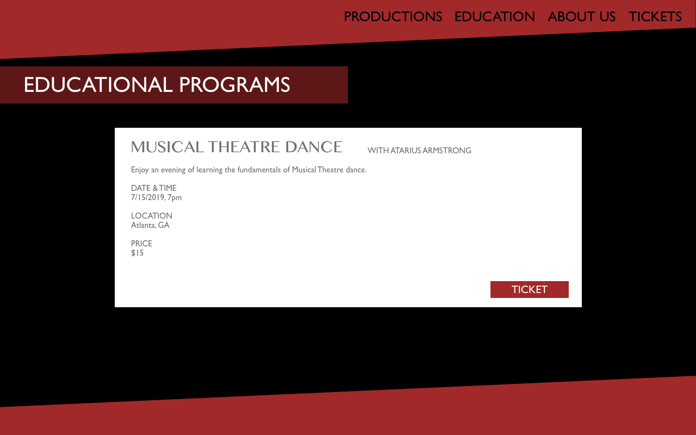

# rea_entertainment
Unit 4 Project for General Assembly ATL by Atarius Armstrong

This is a mock fullstack application for a production company using React.js and Django/Python. It utilizes the Google Calendar API to see their upcoming performances and workshops.

[Trello](https://trello.com/invite/b/dVuAhbSH/4ed88953ec7228d9766a4fd7123929b8/rea-entertainment)

Wireframe
---
created with Adobe XD

Dependencies
---
* Django
* React.js
* Axios
* Google Calendar API
* React Big Calendar
* React Google Calendar
* Styled Components

Technologies Used
---
* Language: HTML5, CSS3, Javascript, Python
* Adobe XD
* Royalty-free images from Unsplash

